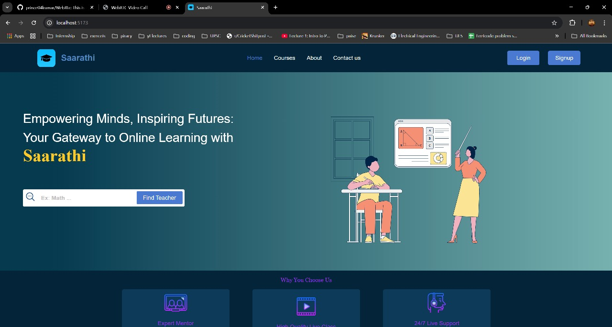
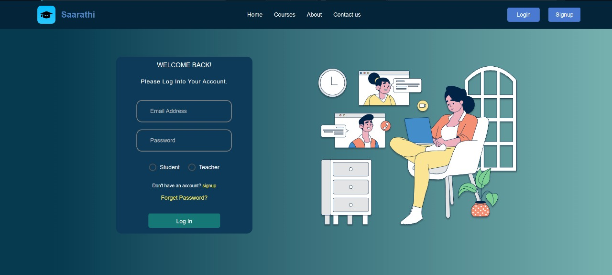
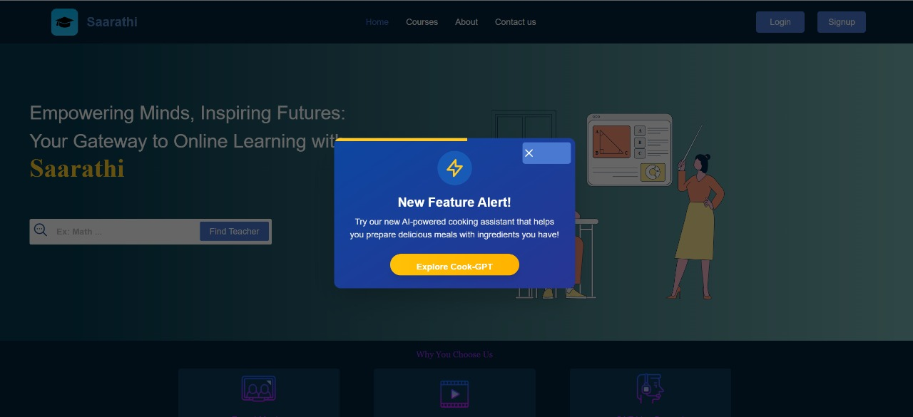
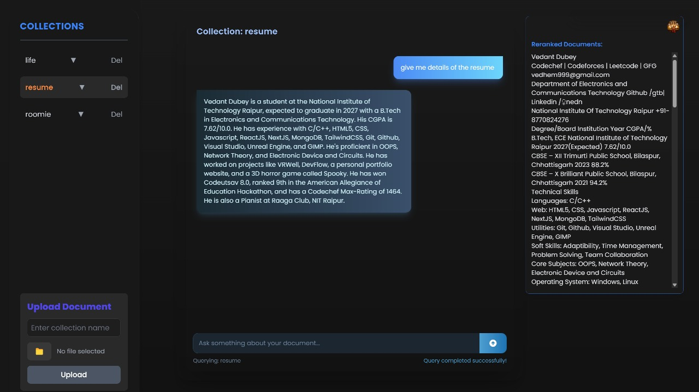

# Online Learning Platform

Online Learning Platform using MERN Stack

## Objective:
Develop a Web2-based e-learning system tailored to the specific needs of a college environment. This system will facilitate seamless communication between students and faculty, streamline course management, and enhance the overall learning experience.

## Features

#### 1. *User Authentication:*
   - Student Login
   - Teacher Login
   - Admin Login

     

#### 2. *Application Approval:*
   - Students and teachers can submit applications for approval.
   - Admin validates and approves applications.

     

#### 3. *Dashboard:*
   - Students see purchased courses, progress, and communication options.
   - Teachers view created courses, student enrollments, and communication features.

     

#### 4. *Course Opting:*

   - Students can browse and attend courses on the platform.
     
#### 5. *Live Video Conferencing:*
   - Integrated video conferencing tool (similar to Google Meet) for real-time teacher-student interaction.

#### 6. *AI-Powered Education:*
   - ILinked RAG Based Chatbot to help students summarise and study effectively from documents and pdfs.   

   

#### 7. *Communication:*
   - In-platform messaging system for communication between teachers and students.

## Key Features to be implemented
1. **Admin Portal**  
   - User Management: Register and manage faculty/student accounts.  
   - Course Management: Create, edit, and delete courses.  
   - Report Generation: View student performance/course progress/faculty activities.  
   - System Monitoring: Track platform usage and handle support requests.  
   - Announcements: Broadcast notifications or updates to users.

2. **Faculty Portal**  
   - Course Creation & Management: Create and update course content (lectures, PDFs, videos).  
   - Assignment & Quiz Management: Upload assignments, set deadlines, and create quizzes with auto-grading.  
   - Student Performance Tracking: Grade assignments, provide feedback, and monitor progress.  
   - Notifications & Reminders: Send announcements regarding classes, assignments, and exams.

3. **Student Portal**  
   - User Registration & Authentication: Secure login using college credentials.  
   - Course Enrollment: Browse and enroll in available courses.  
   - Lecture Access: Play recorded/live classes and access course materials.  
   - Assignment Submission: Submit assignments online and track due dates.  
   - Quiz & Exam Participation: Take online quizzes, view results, and track progress.  
   - Grades & Feedback: Access grades, feedback, and performance analytics.  
   - Push Notifications: Get alerts for classes, assignments, and announcements.

4. **Bonus Features**  
   - AI-based Course Recommendations  
   - Gamification & Leaderboard  
   - Offline Access  
   - Student-Faculty Chat  
   - Plagiarism Detection

## Submission Requirements
- **Deployment Link**: A live URL to the deployed platform.  
- **Video Demonstration**: Max 5-minute demo of key features.  
- **Presentation Slides**: Up to 5 slides covering idea, tech stack, and implementation.  
- **GitHub Repository Link**: A well-organized GitHub repo with documentation.  
- **Project Documentation**: Include system architecture and local setup instructions.

## *Tech Stack:*

#### *UI/UX:*
  - Figma 
  - Dribbble

#### *Frontend:*
  - React (Vite) for dynamic and responsive UI.

#### *Backend:*
  - Node.js, Express and Mongoose for server-side development.

#### *Database:*
  - MongoDB for storing user profiles, course details, and application data.

#### *Authentication:*
  - JWT (JSON Web Tokens) for secure authentication.

#### *Video Conferencing:*
  - Integrate WebRTC for real-time video communication.
  - Using google meet link

#### *RAG Based Chatbot for students*
  - Students can access specialised chatbot for context querying.